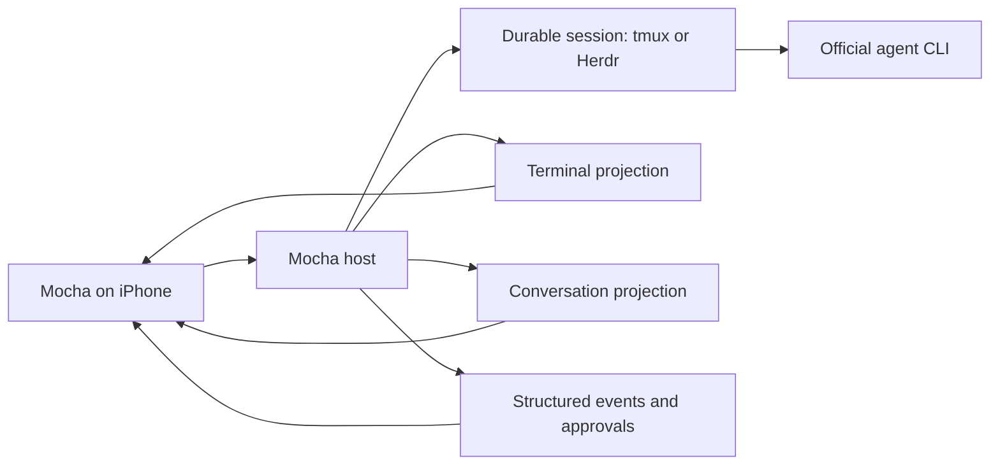

# Mocha chat UI, provider compliance, and agent-neutral architecture

**Research date:** 2026-08-19
**Scope:** a commercial iOS client controlling coding agents on computers the user owns
**Audience:** developers who already use Codex, Claude Code, or another terminal agent
**Time horizon:** architecture for v1, optional chat work immediately after terminal reliability, and later structured adapters

> This is product and engineering research, not legal advice. Vendor documentation and terms can change. Re-check the cited pages and obtain counsel or written vendor clarification before public release of subscription-backed rich integrations.

## 1. Executive verdict

Mocha can offer a chat-style UI without becoming a model proxy or copying vendor credentials. The safe system boundary is: the vendor's official CLI or documented local protocol remains the runtime and authentication client on the user's computer; Mocha presents and controls that existing session over its own private host protocol.

Codex has the clearest rich-client path. OpenAI explicitly documents Codex app-server as the interface for embedding Codex into a product, including authentication, history, approvals, and streamed events. The integration should run locally through stdio or a Unix socket, identify itself honestly, and expose only normalized data through Mocha's authenticated private protocol. OpenAI documents app-server's direct WebSocket transport as experimental and unsupported, so it should not be the phone transport. See [Codex app-server](https://developers.openai.com/codex/app-server) and [Codex authentication](https://developers.openai.com/codex/auth).

Anthropic draws a stricter authentication boundary. Its current Claude Code legal guidance says third-party products must not offer Claude.ai login or route requests through users' Free, Pro, or Max subscription credentials; product integrations should use API-key authentication through Claude Console or a supported cloud provider. Therefore Mocha must never implement “Sign in with Claude,” copy Claude OAuth tokens, or turn a subscription into a third-party model backend. See [Claude Code legal and compliance](https://code.claude.com/docs/en/legal-and-compliance).

The practical product answer is a layered conversation experience:

1. **Universal terminal:** every CLI works; no provider integration is required.
2. **Local conversation projection:** Mocha displays an existing terminal session as messages when it has trustworthy local inputs. Prompts still enter the same official CLI session; no model HTTP request or vendor token crosses Mocha.
3. **Structured adapter:** richer messages, tools, approvals, history, and steering are enabled only through a documented vendor interface and its permitted authentication mode.

The core should be described as **agent-neutral and capability-based**, not as a universal model API. Codex and Claude Code are first-class featured integrations, while any terminal agent retains the universal fallback.

## 2. Compliance boundary

### 2.1 What Mocha is

- A private remote terminal and session-control client for a computer the user owns.
- A presentation layer over sessions already running in tmux, Herdr, or another supported multiplexer.
- An optional local event and conversation client when the provider exposes a documented protocol or hook.
- A device-authenticated connection between the user's phone and host.

### 2.2 What Mocha is not

- A model proxy, router, reseller, or shared subscription.
- A replacement OAuth client for ChatGPT or Claude.ai.
- A service that copies provider refresh tokens, browser cookies, Keychain entries, or CLI credential files.
- A browser automation layer for ChatGPT or Claude.ai.
- An Anthropic subscription-backed Agent SDK service for third-party customers.
- A product that impersonates an official vendor client or hides its own client identity.

### 2.3 Authentication ownership

| Integration | Provider authentication owner | What Mocha receives | Recommended status |
| --- | --- | --- | --- |
| Generic terminal CLI | The CLI on the host | PTY input/output only | Allowed baseline |
| Codex terminal | Official Codex CLI on the host | PTY input/output only | Allowed baseline |
| Codex structured chat | Local Codex app-server, using its supported ChatGPT or API-key sign-in | Normalized thread, turn, item, approval, and status data; never the upstream credential | Recommended rich integration |
| Claude Code terminal | Official interactive Claude Code CLI on the host; user signs in directly with Anthropic | PTY input/output and explicitly enabled local hook events | Baseline, low integration risk |
| Claude local conversation projection | Official Claude Code CLI remains the request client | Locally read presentation data and documented hook events; no OAuth token | Terms review and explicit user opt-in before public release |
| Claude structured product adapter | Claude Console API key or supported cloud-provider credential on the host | Normalized Agent SDK/structured output; never the raw credential on the phone | Permitted architecture for a product integration |
| Claude subscription OAuth used by Mocha as a backend | Mocha would route user subscription requests | OAuth token or derived request capability | Prohibited by current Anthropic guidance |

## 3. Chat UI architecture

### 3.1 One session, multiple views

The terminal session is the durable object. Terminal and Chat are sibling presentations, not separate conversations:

Required UX rules:

- `Terminal` is always available.
- `Chat` appears only when the active adapter advertises `conversation.read` and `conversation.send`.
- Tool cards and approvals appear only when their source is documented and identified.
- Every structured item carries an authority label such as `Codex app-server`, `Claude hook`, `Herdr`, or `terminal projection`.
- If parsing becomes stale or ambiguous, the UI stops upgrading the view and offers `Open terminal`; it never invents a message or approval state.
- Sending a prompt shows its route: `send to terminal`, `start Codex turn`, or `steer active Codex turn`.

### 3.2 Codex chat path

OpenAI's official documentation states that Codex app-server exists to power rich clients and supports conversation history, approvals, and streamed agent events. It also requires clients to identify themselves through `clientInfo`; enterprise integrations should contact OpenAI about the known-client list. See [Codex app-server initialization](https://developers.openai.com/codex/app-server).

Implementation:

1. The Mocha host launches the installed `codex app-server` locally.
2. It communicates through stdio or a protected Unix socket.
3. It initializes with an honest client identity such as `agent_deck_host`; it never impersonates the VS Code extension.
4. It stays on the stable capability surface by default. Experimental methods require an explicit development flag and never become a silent release dependency.
5. It maps threads, turns, messages, tool items, approvals, status, and interrupts into the Mocha capability schema.
6. The phone receives only Mocha data through the paired-device connection.
7. Codex/ChatGPT credentials remain inside the official Codex installation on the host. OpenAI documents both ChatGPT subscription and API-key authentication for local Codex clients. See [Codex authentication](https://developers.openai.com/codex/auth).

### 3.3 Claude chat paths

#### Safe baseline: official interactive CLI

- The user installs and signs in to Claude Code directly on the host.
- Claude Code runs normally inside tmux or Herdr.
- Mocha transports terminal input/output and does not make Anthropic API calls.
- Optional documented Claude Code hooks can report lifecycle, permission, tool, and stop events to a localhost Mocha endpoint. Claude Code officially documents JSON hook events and includes the local `session_id`, `cwd`, and `transcript_path`. See [Claude Code hooks](https://code.claude.com/docs/en/hooks) and [hooks guide](https://code.claude.com/docs/en/hooks-guide).

#### Local conversation projection

An opt-in host adapter may project the user's existing local Claude Code session into messages without becoming the model client:

- prompts are sent back through the live terminal session;
- hook events provide lifecycle and tool boundaries;
- locally stored conversation data may be read only on the host and only for the active user-selected session;
- the projection is labeled `Local CLI projection`, not `Claude API`;
- terminal is the authority and escape hatch;
- no credential file, Keychain item, OAuth token, or browser session is read;
- no transcript is uploaded to Mocha infrastructure.

This is a defensible remote-terminal interpretation, but Anthropic's public restriction is broad enough that a commercial, Claude-branded chat replacement should receive written clarification before release. Until then, ship this behind a provider kill switch and avoid claiming an official Claude integration.

#### Fully structured Claude product integration

For an unambiguous rich product adapter, use the Claude Agent SDK or structured CLI mode with an API key from Claude Console or a supported cloud provider, kept on the host. Do not ask users to paste subscription OAuth tokens into Mocha. Anthropic's legal guidance explicitly directs product developers to API-key or supported-cloud authentication. See [Claude Code legal and compliance](https://code.claude.com/docs/en/legal-and-compliance) and [Claude Code authentication](https://code.claude.com/docs/en/authentication).

## 4. Agent-neutral capability model

### 4.1 Do not abstract “the model”

Mocha does not need a universal `sendPrompt(provider, model)` API. That would turn it into the harness we are avoiding. It needs a universal session contract with optional capabilities.

Core entities:

- `Host`
- `Workspace`
- `SessionTarget`
- `Conversation`
- `Turn`
- `Message`
- `ActivityItem`
- `ApprovalRequest`
- `Attachment`
- `CapabilitySet`
- `Authority`

Core capability groups:

| Capability | Meaning |
| --- | --- |
| `terminal.attach/input/resize` | Universal PTY operation |
| `session.list/resume/interrupt` | Durable session control |
| `lifecycle.events` | Started, working, waiting, stopped, completed |
| `conversation.read/send` | Render and send chat messages |
| `turn.start/steer/interrupt` | Structured turn semantics |
| `activity.tools` | Structured tool calls/results |
| `approval.read/respond` | Safe structured approvals |
| `diff.read` | Changed-file and patch projection |
| `attachments.send` | Images/files with a defined route |
| `usage.read` | Provider-reported usage, with provenance |

Every capability declaration includes:

- adapter identifier and version;
- source authority;
- authentication mode (`official_cli`, `user_api_key`, `cloud_provider`, or `none`);
- stability (`stable`, `experimental`, `projection`);
- supported actions;
- last successful compatibility check.

### 4.2 Adapter contract

Adapters run on the host and may be added independently:

- `TerminalAdapter`: every CLI, terminal only.
- `TmuxAdapter`: durable hierarchy and attach.
- `HerdrAdapter`: agent-aware hierarchy and lifecycle state.
- `CodexAppServerAdapter`: official structured Codex integration.
- `ClaudeCodeTerminalAdapter`: official CLI plus documented hooks and optional local projection.
- `ClaudeApiAdapter`: API-key/cloud-provider structured integration, later.
- Community/future adapters: accepted only with a documented surface, conformance tests, terms review, and terminal fallback.

The iOS app renders capabilities; it contains no provider-specific networking or credential code.

## 5. Highlight Codex and Claude without locking the product

Recommended positioning:

> **Built first for Codex and Claude Code. Works with any terminal agent.**

Product treatment:

- Codex and Claude Code appear first in onboarding, launch templates, compatibility tests, documentation, and screenshots because they are the flagship experiences.
- Navigation remains neutral: `Attention`, `Sessions`, `Terminal`, `Chat`, and `Review`, not provider-specific tabs.
- A detected session gets its accurate provider name and an approved brand asset where current trademark guidance permits; otherwise use a text label or Mocha-owned neutral glyph.
- The App Store name remains `Mocha`. Do not put vendor model/product names into Mocha's product identity or imply partnership/endorsement.
- Marketing says `Works with Codex and Claude Code`, not `Official Codex + Claude client` unless written permission exists.
- Other agents receive the same session contract and can progressively gain richer capabilities without changing the app shell.

Before public marketing, complete a fresh vendor trademark review. Use compatibility wording rather than partnership wording, keep Mocha's identity primary, and do not ship vendor logos until the current asset license or written permission has been verified.

## 6. Release recommendation

### V1

- Universal Ghostty terminal.
- tmux and Herdr durability.
- Codex and Claude Code launch/attach templates.
- Documented hooks/events for attention where available.
- Provider identity, capability, authority, and authentication-mode schema.
- No provider OAuth handling.

### V1.1

- `Terminal | Chat` view switch.
- Codex structured chat through local app-server stable APIs.
- Claude local CLI projection only after written clarification/terms review; otherwise keep Claude in enhanced terminal mode.
- Generic best-effort conversation projection only when it can fail visibly and safely back to terminal.

### Later

- Claude API-key/cloud-provider structured adapter.
- Additional adapters one at a time.
- Rich approvals, tool cards, queue/steer, and usage only when the active adapter declares authoritative support.

## 7. Go/no-go checklist for every provider adapter

An adapter ships only if every answer is satisfactory:

1. Is the interface official, documented, or explicitly intended for extension?
2. Is the authentication mode permitted for a third-party product?
3. Does the provider credential remain on the host and outside Mocha's protocol?
4. Does the adapter identify Mocha honestly?
5. Can the adapter be disabled without losing terminal access?
6. Is every semantic state labeled with its authority and freshness?
7. Are destructive approvals protected from stale or duplicated responses?
8. Are version detection, conformance fixtures, and a remote kill switch present?
9. Are privacy behavior and any transcript persistence disclosed?
10. Have current legal, brand, and App Store requirements been reviewed?

## 8. Primary sources

- [OpenAI Codex app-server](https://developers.openai.com/codex/app-server)
- [OpenAI Codex authentication](https://developers.openai.com/codex/auth)
- [Claude Code legal and compliance](https://code.claude.com/docs/en/legal-and-compliance)
- [Claude Code authentication](https://code.claude.com/docs/en/authentication)
- [Claude Code hooks reference](https://code.claude.com/docs/en/hooks)
- [Claude Code hooks guide](https://code.claude.com/docs/en/hooks-guide)
- [Claude Code CLI reference](https://code.claude.com/docs/en/cli-usage)
