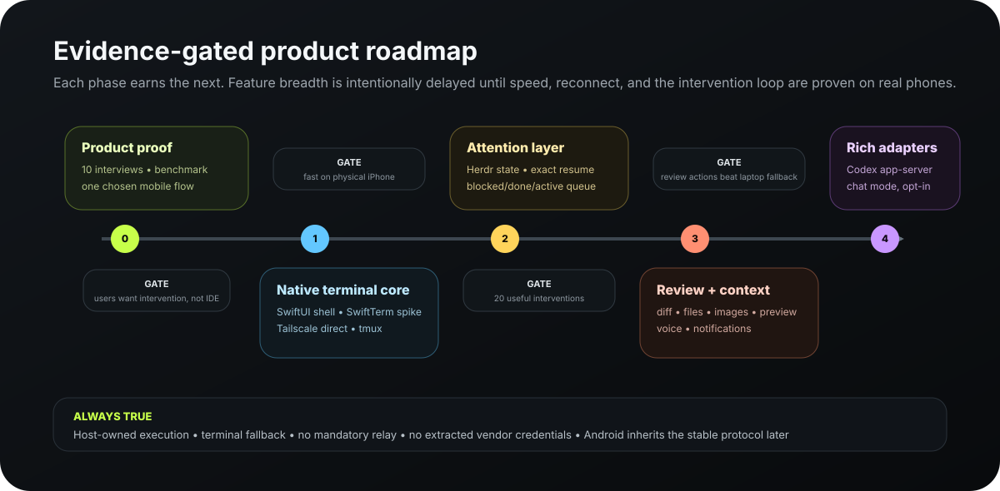

# Mocha implementation plan

**Status:** Phase 1 implementation complete; physical-iPhone qualification pending
**Updated:** 2026-08-19
**Execution rule:** evidence-gated phases; do not expand the feature surface until the prior phase meets its exit criteria
**Engineering policy:** every production change must satisfy [`DEVELOPMENT_PRINCIPLES.md`](./DEVELOPMENT_PRINCIPLES.md)



## 1. Technical baseline

The repository already contains:

- a Node host using a PTY and tmux;
- token authentication;
- HTTPS/WebSocket exposure through Tailscale Serve;
- a working direct-path proof that the user has tested from a phone.
- a platform-neutral record of the current host contract in [`protocol/`](../protocol/README.md).

The native iOS app should consume a versioned evolution of this host protocol. We should not rewrite both host and client before measuring the current path.

## 2. Phase 0 — product and benchmark preparation

### Deliverables

- Treat [`assets/agent-deck-v1-home-terminal.png`](./assets/agent-deck-v1-home-terminal.png) as the approved V1 Home + Terminal visual target; validate its primary customer journey on a real iPhone before expanding the screen set.
- Treat [`assets/agent-deck-v1-pairing-flow.png`](./assets/agent-deck-v1-pairing-flow.png) as the approved V1 scan-first onboarding target.
- Use the installed Xcode 26.6 toolchain and configure a free Personal Team for device testing.
- Create the minimal iPhone-first SwiftUI workspace with product/target/module `Mocha`, bundle identifier `com.parvezrob.mocha`, minimum deployment target iOS 26, and Swift 6 language mode.
- Add a reproducible script/build job for the pinned GhosttyKit XCFramework and record the exact upstream/fork commit plus downstream patches.
- Build a recorded terminal corpus from Codex, Claude Code, tmux, Herdr, shell, Unicode, and high-frequency redraw cases.
- Add host-side timestamping and connection diagnostics needed for latency measurement.
- Document the initial protocol schema and capability negotiation.

### Exit criteria

- The primary journey can be completed in a native interaction prototype and its information hierarchy is approved.
- Physical iPhone can run a signed development build.
- Benchmark corpus and measurement method are reproducible.
- No unresolved decision about whether the first app attaches through the existing host bridge.

## 3. Phase 1 — terminal and transport spike

### Terminal dependency decision

The first spike follows Moshi's proven shape: Ghostty's native Metal surface with an external byte-input/write-callback backend. Mocha pins the `wiedymi/ghostty` custom-I/O fork at `91fe505e60bbe72ff08c881d2882acad6a56cb9f` and builds it through [`scripts/build-ghosttykit.sh`](../scripts/build-ghosttykit.sh). The repository owns a minimal patch set for macOS 26 SDK compatibility and the fork's missing callback process-info case; the generated XCFramework remains an ignored local artifact.

This pin is an experiment behind `AgentTerminalView`, not a stability claim. Ghostty issue [#13021](https://github.com/ghostty-org/ghostty/issues/13021) reports an iOS device use-after-free during surface teardown on the same fork revision. GitHub issue [#5](https://github.com/parvezrob/mocha/issues/5) is a release-blocking physical-device lifecycle gate. Mocha does not ship this renderer until repeated create/destroy, background/foreground, lock/unlock, and session-switch tests pass without the crash.

### Scope

Implement the thinnest native vertical slice:

1. Hard-coded development host.
2. Connect over secure WebSocket through Tailscale Serve.
3. Attach to one existing tmux session.
4. Render output in a UIKit-hosted GhosttyKit/Metal surface through `AgentTerminalView`.
5. Send input from a multiline composer and quick-key row.
6. Resize, background, foreground, switch Wi-Fi/cellular, and reconnect.

Qualify:

- Pinned GhosttyKit build with remote PTY byte injection and input callbacks.
- Batched versus unbatched remote writes under chatty agent output.
- Recorded host-protocol fixtures and terminal output corpus as the compatibility baseline.
- SwiftTerm only if needed to diagnose whether a release blocker belongs to Ghostty or to our surrounding transport/input code.

### Measurements

- app launch to terminal first paint;
- socket open to first paint;
- input sent to echo/render;
- sustained redraw frame rate and dropped frames;
- memory during long output and scrollback;
- CPU/thermal behavior;
- repeated terminal-surface create/destroy and rapid session switching;
- phone lock/unlock, background/foreground, rotation, and memory-pressure recovery;
- selection/copy/paste correctness;
- wide glyph, emoji, bidi, CJK/IME behavior;
- reconnect time and lost/duplicated input.

### Exit criteria

- The pinned GhosttyKit build meets the PRD targets or a specific release-blocking defect triggers the documented fallback decision.
- No reproducible Metal/Core Animation crash across the lifecycle stress suite.
- No session loss across repeated background/foreground and network-switch tests.
- No ambiguous input replay.
- Terminal can operate Codex and Claude Code TUIs on a physical phone.

### Phase 1 implementation evidence (2026-08-19)

The code-complete simulator slice now includes the pinned GhosttyKit Metal renderer, secure WebSocket transport, strict `mocha.v1` messages, bounded frames, heartbeat, resize, explicit connection states, bounded exponential reconnect, deliberate composer/quick-key input, and no ambiguous input replay. Authentication and protocol failures are covered before a PTY can be spawned; malformed input is never written to the terminal.

| Check | Evidence | Result |
|---|---|---|
| Real transport | Tailscale Serve WSS to the local host, authenticated without a token in the URL | Passed in iOS 26.5 simulator |
| Durable terminal | Attached to a synthetic tmux fixture, executed a command, observed its output, and retained the same session across reconnect | Passed |
| App lifecycle | Background/foreground resumed the existing terminal; rotation recomputed the grid while connected | Passed in simulator |
| Network/host loss | Stopping the host surfaced `Reconnecting`; restarting it restored the same tmux session without replaying input | Passed in simulator |
| Renderer lifecycle | UI automation replayed the shared ANSI/Unicode/split-control/chatty corpus through Ghostty while creating and destroying the surface eight times, including one background/foreground cycle | Passed in simulator |
| Automated tests | 22 logical tests / 30 parameterized runs, including two UI journeys, plus 27 host tests | Passed locally |
| Independent review | Swift/lifecycle/accessibility and transport/security reviewers re-reviewed every resolved finding | No actionable P0/P1/P2 findings remain |
| First output | 149–529 ms from connection start to first terminal output across warm and cold simulator runs on an Apple Silicon development Mac | Provisional simulator measurement |
| Input-to-output | 23 ms from deliberate input submission to the first returned PTY output | Provisional simulator measurement |
| Memory | 217,200 KiB resident for the debug simulator process during a connected session | Provisional; not a release budget |

These numbers establish a reproducible local baseline, not phone performance. GitHub issue [#4](https://github.com/parvezrob/mocha/issues/4) remains open for the physical-device checklist. Ghostty lifecycle issue [#5](https://github.com/parvezrob/mocha/issues/5) remains release-blocking until repeated real-device create/destroy, background/foreground, lock/unlock, network switching, sustained corpus output, selection/paste, and Codex/Claude Code TUI tests pass without the reported teardown fault.

## 4. Phase 2 — stable host protocol and providers

### Host refactor

Create a versioned capability model rather than hard-code client assumptions.

Suggested provider boundaries:

```text
HostProvider
  listTargets()
  createTarget(request)
  attach(targetId, dimensions)
  rename(targetId, name)
  close(targetId, confirmation)
  capabilities(targetId)

AttentionProvider (optional)
  listAttention()
  subscribeEvents(cursor)
  getState(targetId)
  getPreview(targetId)
```

Initial implementations:

- `TmuxProvider`: durable terminal hierarchy and attach; semantic state is unknown by default.
- `HerdrProvider`: workspace/tab/pane hierarchy, state, provenance, preview/event cursor, direct attach.

### Protocol work

- Versioned handshake and minimum supported client/host versions.
- Machine identity separate from mutable display name/address.
- Stable target identifiers.
- Capability negotiation per host/provider/target.
- Resumable event cursor for state updates.
- Bounded terminal frame messages and explicit resize/input messages.
- Error taxonomy: authentication, version, offline, stale target, permission, provider unavailable, overloaded.
- Redacted diagnostics endpoint.

### Exit criteria

- Contract tests pass for both providers.
- Native and host contract tests define compatibility; no former client implementation constrains protocol evolution.
- No provider-specific logic is required inside the terminal renderer.
- Generic tmux targets never receive fabricated semantic state.

## 5. Phase 3 — pairing, hosts, and native app shell

### Client architecture

Implement the route hierarchy and recovery behavior defined in [`V1_SCREEN_AND_NAVIGATION_MAP.md`](./V1_SCREEN_AND_NAVIGATION_MAP.md). The app coordinator—not an individual tab—owns pairing/main gating, presented sheets, deep-link resolution, and the foreground terminal target.

Suggested modules:

```text
MochaApp
  AppCoordinator
  AppShell
  Pairing
  Hosts
  Attention
  Sessions
  Terminal
  Security
  Diagnostics
  DemoMode

Core
  Protocol
  Networking
  Models
  Persistence
  Observability
```

### Pairing security

- `mocha pair` shows a QR containing host URL, machine fingerprint, and single-use bootstrap secret.
- App shows a human-verifiable machine name/fingerprint.
- Bootstrap exchange creates a random device credential and invalidates the QR secret.
- Credential lives in Keychain and can be protected by biometry.
- Host exposes paired-device list and revoke.

### UI scope

- Scan-first onboarding: concise boundary statement, QR scanner, host/fingerprint and shell-access verification, progressive connection checks, ready state, and safe-disconnect reminder.
- QR/manual pairing.
- Home with Needs attention, Active, Recent, Hosts.
- Host detail and diagnostics.
- Settings for security, terminal, privacy, and demo mode.
- SwiftUI navigation and sheets; UIKit terminal wrapper.
- Two root destinations (`Sessions`, `Inbox`), a separate New sheet, contextual host management, push request detail, and a root-level focused terminal presentation.

### Exit criteria

- Pair, revoke, re-pair, edit address, and remove host pass end-to-end tests.
- Revocation terminates or rejects active/new connections.
- Demo mode exercises the core UI offline.
- Dynamic Type, VoiceOver labels, Reduce Motion, and contrast are verified outside terminal content.

## 6. Phase 4 — intervention loop

### Scope

- Needs-attention ordering from Herdr or explicit events.
- Recent preview with privacy preference.
- Exact one-tap resume.
- Composer, quick keys, interrupt, paste, selection, live mode.
- State provenance and stale-state display.
- Mark viewed/done behavior that does not overwrite host truth.
- Confirmation for close/kill and other destructive actions.

### Dogfood protocol

For every intervention, log locally:

- trigger;
- connection path and latency;
- time to correct session;
- action taken;
- whether a laptop was needed;
- trust or state error;
- renderer/input issue.

No terminal contents should enter metrics by default.

### Exit criteria

- 20 successful founder interventions.
- Median open-to-correct-session under 5 seconds.
- At least 80% completed without laptop fallback.
- Zero known false high-confidence attention labels.

## 7. Phase 5 — context and ambient features

Build in this order, stopping if reliability regresses:

1. Explicit-event local notifications/push design.
2. Live Activity and Dynamic Island state.
3. Read-only diff viewer.
4. Photo/file upload with remote-path confirmation.
5. File/Markdown/image/PDF preview.
6. Private dev-server preview.
7. Voice composer and saved quick actions.

Each feature must declare:

- provider and host capabilities required;
- whether data leaves the direct connection;
- stale/offline behavior;
- destructive actions and confirmation;
- terminal fallback.

## 8. Phase 6 — App Store readiness

### Developer account

Use free Personal Team provisioning during early development. Enroll in the paid Apple Developer Program before TestFlight distribution and capabilities that require membership.

### Review package

- Fully featured demo mode with realistic hosts, sessions, terminal output, attention, offline, and reconnect states.
- Review notes explaining that execution occurs on a user-owned computer and the app is a generic terminal/control utility.
- Screen recording of pairing and direct host use.
- Support and privacy URLs.
- Clear disclosure of required host companion for real connections.
- No provider logos or claims suggesting endorsement without permission.
- Explanation that third-party provider accounts are configured only on the host.

### Quality gates

- Crash-free beta threshold met.
- IPv6-only network test.
- Low-memory and thermal test.
- Background/foreground test matrix.
- Keychain migration and credential deletion tests.
- Privacy manifest and network-use review.
- Terminal-content redaction audit.

## 9. Phase 7 — optional rich adapters

### Agent-neutral adapter contract

The iOS app consumes capabilities, not provider APIs. Each host adapter declares its id/version, authority, authentication mode, stability, supported actions, and last successful compatibility check. Shared capabilities cover terminal I/O, lifecycle, conversation, structured turns, tool activity, approvals, diffs, attachments, usage, and exact resume. The complete schema and compliance rules live in [`CHAT_UI_AND_AGENT_ARCHITECTURE.md`](./CHAT_UI_AND_AGENT_ARCHITECTURE.md).

### Codex adapter

Use the official local Codex app-server through stdio or a localhost/Unix-socket path owned by the host. Do not expose its experimental, unsupported remote WebSocket transport directly.

Initialize with an honest Mocha `clientInfo`; do not impersonate another Codex client. Default to the stable API surface and gate experimental methods behind development-only flags.

Capabilities can include:

- thread list/read/resume;
- structured streamed items;
- approvals;
- runtime status;
- history and archive;
- queued/steering prompts if supported by the stable interface.

The adapter is capability-gated and can be disabled without affecting terminal access.

### Claude Code adapter

Ship two explicitly different modes:

1. **Enhanced terminal:** official interactive Claude Code runs in tmux/Herdr and owns subscription authentication. Optional user-approved hooks deliver lifecycle/tool metadata to localhost. Mocha receives no Claude credential and makes no Anthropic model request.
2. **Structured product adapter:** Claude Agent SDK or structured CLI mode uses a Claude Console API key or supported cloud-provider credential kept on the host. Never offer Claude.ai login or route a user's Free/Pro/Max credentials.

An optional local conversation projection over the interactive CLI must remain local-only, opt-in, authority-labeled, kill-switchable, and blocked from public release until the current terms interpretation is reviewed or clarified in writing.

### Other providers

Require all of:

- documented public interface or supported hook;
- no OAuth token extraction or browser automation;
- authentication mode permitted for a third-party product;
- honest client identity and accurate compatibility branding;
- terms review;
- version detection;
- conformance tests;
- terminal fallback;
- kill switch in host capability configuration.

## 10. Test matrix

### Devices

- Oldest practical iPhone that supports iOS 26.
- Current standard-size iPhone.
- Current Pro Max or equivalent large device.

### Planned iPad qualification after iPhone V1

- iPad with software keyboard.
- iPad with hardware keyboard/trackpad.

### Networks

- Same LAN.
- Tailscale direct Wi-Fi.
- Tailscale direct cellular.
- Tailscale DERP relay.
- Tailscale peer relay if available.
- Wi-Fi → cellular and cellular → Wi-Fi.
- Temporary offline, captive portal, host sleep/wake.

### Hosts

- macOS laptop.
- macOS desktop.
- Linux host.
- Multiple simultaneous hosts.

### Sessions

- shell;
- Codex;
- Claude Code;
- Herdr with multiple agents;
- tmux multiple windows/panes;
- unsupported full-screen TUI;
- long-running high-output command;
- Unicode/CJK/emoji/bidi corpus.

### Security

- expired/used pairing code;
- revoked device;
- wrong certificate/fingerprint;
- replayed credential;
- public/non-TLS endpoint;
- secret-bearing terminal content in notification/log paths;
- locked phone and biometric failure.

## 11. Repository evolution

Current ownership structure and planned native contents:

```text
apps/
  host/                 existing Node host, refactored providers
  ios/                  Xcode project and Swift packages
docs/                    product source of truth and research
protocol/                schemas, examples, compatibility fixtures
fixtures/terminal/       renderer and protocol replay corpus
```

`apps/ios` now owns the native client. Generate the Xcode project with the locked identity and platform settings; select and pin the GhosttyKit source during the terminal qualification issue rather than guessing it in the project scaffold.

The browser prototype and web deployment configuration have been removed. Do not reintroduce a second client target without an explicit product decision and an independently justified maintenance budget.

## 12. Immediate next work

1. Generate the minimal iOS 26, iPhone-first Xcode project with `com.parvezrob.mocha` and Swift 6 strict concurrency.
2. Run the terminal/transport spike and pin the qualified GhosttyKit source before implementing the complete app shell.
3. Plan iPad-specific layout, keyboard, and interaction optimization only after the iPhone V1 gates pass.
