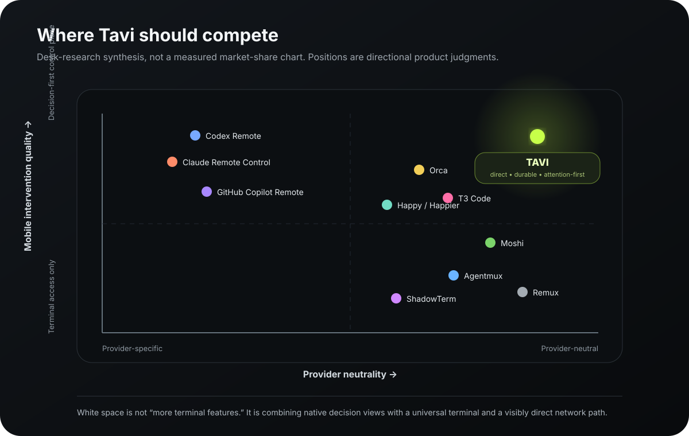
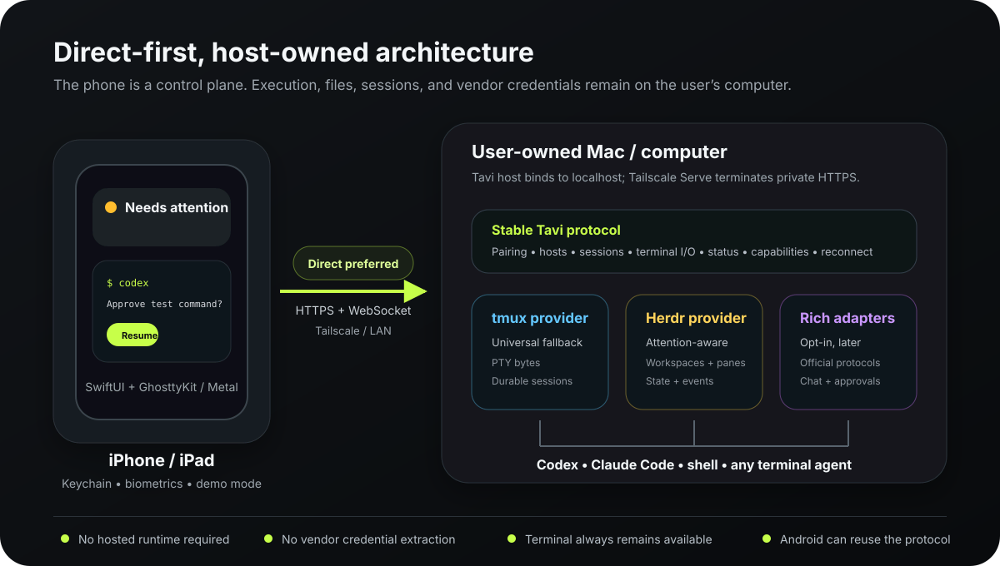

# Mocha research and product strategy

**Status:** Research baseline / draft for product review
**Updated:** 2026-08-19
**Research horizon:** current public product capabilities as of 2026-08-19
**Primary platform:** native iOS in SwiftUI; Android after the core workflow and protocol are proven
**Evidence base:** founder problem statement, current Mocha prototype, official product documentation, public source repositories, App Store listings, and platform documentation

> This is desk research plus a strong founder-use-case signal. It is not yet customer validation. Product claims below are labeled as evidence, inference, or recommendation so that development does not mistake a hypothesis for a fact.

## 1. Executive conclusion

Mocha should not be built as another mobile SSH client, another agent harness, or a provider-specific chat client.

It should be the **fastest private, vendor-neutral mobile control plane for coding work running on computers you own**.

The core mobile loop is:

1. Open the app.
2. See which host and session needs attention.
3. Resume the exact durable pane.
4. Read enough context to decide.
5. Send a prompt, key, approval, or interrupt.
6. Leave without disrupting the process.

The full terminal remains essential because it is the universal compatibility layer. It should not be the entire product. The differentiating layer is a native attention queue, exact session resume, high-confidence state when a provider can supply it, and a visibly direct network path.

## 2. The problem we are solving

Long-running coding agents create a new kind of remote-work interruption. The user does not usually need a full IDE on a phone. They need to know whether an agent is still working, finished, or blocked; understand the immediate question; make one decision; and return to their day.

Today the available solutions force one or more compromises:

- **Vendor-native remote experiences** can be excellent but only manage that vendor's work.
- **Agent harnesses and wrappers** normalize several providers but become a new runtime, protocol, or account dependency.
- **General mobile terminals** preserve compatibility but make the user navigate raw terminal state and multiplexers on a small screen.
- **Desktop companion products** can expose rich context but often inherit relay latency, desktop coupling, or a mobile UI designed after the desktop product.

The user's firsthand result is especially important: a Tailscale path felt fast while a relay path was effectively unusable. This is consistent with Tailscale's documentation: direct peer-to-peer connections normally provide the lowest latency and highest throughput, while relays are fallback paths with additional performance cost. This does not prove all relays are bad; it proves that connection-path visibility and a direct-first policy are product features, not implementation trivia. See [Tailscale connection types](https://tailscale.com/docs/reference/connection-types).

## 3. Category landscape

### 3.1 Vendor-native control planes

OpenAI's Codex Remote and Anthropic's Claude Code Remote Control validate the central mental model: the phone is a control plane while execution remains on the developer machine. OpenAI describes mobile controls for host/workspace selection, worktrees, queued versus steering prompts, approvals, inline review, files, and durable goals. Anthropic lets a phone or browser steer a local Claude Code session, receive push notifications, and preserve local tools and files. See [OpenAI's remote engineering guide](https://developers.openai.com/blog/mastering-codex-remote-for-engineering) and [Claude Code Remote Control](https://code.claude.com/docs/en/remote-control).

**Evidence:** users value native decision surfaces, attachments, approvals, worktrees, and session history more than a shrunken desktop terminal.

**Limitation:** each experience is tied to its provider, account, policies, storage model, and supported execution path. Claude's documentation states that Remote Control routes through Anthropic and stores the synchronized transcript on Anthropic servers while active. That may be acceptable, but it is a different privacy and control model from direct host access.

### 3.2 Cross-provider harnesses and companion systems

T3 Code calls itself an “agent harness control surface” and supports web, desktop, and mobile clients across several provider CLIs. Happy requires users to start agents through its wrapper so sessions can be encrypted and synchronized through its system. Orca makes its desktop/server product the source of truth and offers a mobile companion with status, chat or terminal, source control, files, quick commands, account usage, and workspace creation. See [T3 Code](https://github.com/pingdotgg/t3code), [Happy](https://github.com/slopus/happy), and [Orca Mobile](https://www.onorca.dev/docs/mobile).

**Evidence:** a unified inbox, structured chat, multi-host aggregation, source review, queued prompts, and notifications are valuable enough for multiple products to implement.

**Tradeoff:** the richer the unification, the more the product tends to wrap provider CLIs, maintain provider adapters, depend on a desktop app, or route through hosted infrastructure. That is exactly the maintenance and lock-in surface Mocha is trying to minimize.

### 3.3 Terminal-first mobile developer tools

Moshi, Agentmux, ShadowTerm, and Remux demonstrate that a serious native phone terminal needs far more than VT rendering. Competitive features now include Mosh or reconnect behavior, tmux/Herdr awareness, custom key rows, D-pads and gestures, voice input, OSC 52 clipboard support, file and image upload, file/path recognition, diffs, dev-server preview, Live Activities, and secure credential storage. See [Moshi documentation](https://getmoshi.app/docs), [Agentmux](https://apps.apple.com/us/app/agentmux/id6766158521), [ShadowTerm](https://apps.apple.com/us/app/shadowterm-ssh-mosh-terminal/id6746274402), and [Remux](https://github.com/h3nock/remux).

**Evidence:** “native terminal only” is not a differentiated product in 2026. It is a demanding foundation with an established feature baseline.

**Opportunity:** these products often optimize for terminal breadth. Mocha can optimize for the narrower coding-agent intervention loop, a direct-path performance contract, and progressive provider intelligence without removing the raw terminal.

### 3.4 Agent-aware multiplexers

Herdr is strategically important because it supplies the durable workspace plus a structured attention model. It can roll agent state up from pane to tab to workspace, exposes direct agent attach, and supports hooks, screen manifests, CLI/JSON commands, and a socket API. Its own documentation explicitly frames the workflow as seeing which project needs a decision, remains active, or is ready for review. See [Herdr agent status and rollups](https://herdr.dev/docs/agents/) and [Herdr socket API](https://herdr.dev/docs/socket-api/).

**Recommendation:** support both tmux and Herdr, but treat them differently:

- tmux is the universal durable terminal provider. Do not invent `working` or `blocked` state from arbitrary output.
- Herdr is the preferred attention-aware provider. Use its structured state and attach APIs where available.

## 4. Target users and jobs

### Primary user

A developer or technical founder who:

- runs one or more terminal coding agents on a Mac, Linux machine, devbox, or home server;
- already uses Codex, Claude Code, or other CLI agents through their own subscriptions;
- keeps work alive in tmux or is willing to use Herdr;
- sometimes leaves the computer while an agent is running;
- cares about responsiveness, privacy, and avoiding provider lock-in more than about a fully hosted experience.

### Secondary users

- Developers supervising several agents or worktrees across multiple computers.
- On-call engineers who need a durable terminal plus safe, minimal remote intervention.
- iPad users who may perform longer terminal or review sessions with a hardware keyboard.

### Core jobs to be done

1. **Monitor:** “Tell me which sessions are active, done, or waiting without making me open every terminal.”
2. **Unblock:** “Let me answer the exact question or approval in seconds.”
3. **Steer:** “Let me redirect a running task before it wastes time.”
4. **Resume:** “Take me back to the exact host, workspace, window, and pane.”
5. **Inspect:** “Show enough recent output and changes to make a safe decision.”
6. **Recover:** “Network changes and phone backgrounding should not end my work.”
7. **Stay independent:** “Use the official CLIs and credentials already on my machine; do not make me adopt another agent runtime.”

## 5. Product thesis

### Value proposition

**Mocha lets you supervise and steer any terminal coding agent from your phone with direct-network speed, durable sessions, and no mandatory cloud relay or new agent runtime.**

### Positioning statement

For developers who run coding agents on computers they control, Mocha is a native mobile control plane that finds the session needing attention and returns the user to the exact terminal instantly. Unlike provider-native apps, it works across agents. Unlike harnesses, it does not replace the official CLI. Unlike generic SSH terminals, it organizes work around agent attention and intervention.

### The wedge

The wedge is not “Codex and Claude on a phone.” Many products now make that claim. The wedge is the combination of:

1. **Direct-first performance** — Tailscale or local network path, path diagnostics, no mandatory relay.
2. **Durable exact resume** — host → workspace/session → window/tab → pane/agent.
3. **Attention-first home** — blocked, done, and active work before host lists or usage statistics.
4. **Universal fallback** — a high-quality native terminal works for every CLI and shell.
5. **Progressive intelligence** — structured Herdr state and official provider protocols when stable; never brittle transcript scraping as the only source of truth.
6. **Host-owned trust model** — execution, repository files, and provider credentials remain on the computer.

## 6. What we should build

### The first product, not merely the first technical demo

The first meaningful release should include:

- Native SwiftUI app shell.
- A native terminal view embedded through UIKit.
- Multi-host pairing with a QR-first flow and Keychain storage.
- HTTPS/WebSocket connection to the existing host bridge over Tailscale Serve; manual compatible endpoint entry for LAN or other private HTTPS paths.
- Connection-path and health diagnostics, including whether the tailnet path is direct or relayed when detectable.
- tmux provider for universal session listing, creation, attach, detach, resize, and reconnect.
- Herdr provider for workspaces, tabs/panes, semantic state, events, and direct attach.
- A home screen led by **Needs attention**, followed by active sessions and hosts.
- Cached recent output or terminal preview so users can choose before opening the full session.
- Exact one-tap resume.
- Mobile prompt composer plus quick terminal controls, paste, selection, interrupt, and hardware keyboard support.
- Honest state labels. Unknown remains unknown.
- Built-in demo mode for onboarding and App Review.
- No account, telemetry, or hosted runtime required for the direct mode.

### The second layer

After the intervention loop is proven:

- Notifications and Live Activities driven by explicit Herdr/provider events.
- Diff and changed-file review.
- Photo/file upload to the active working directory with confirmation.
- File and Markdown preview.
- Local dev-server preview through the private connection.
- Voice-to-composer.
- Saved quick actions.

### Optional rich provider adapters

Codex's official app-server is explicitly designed for embedding Codex into rich clients and exposes history, approvals, streamed events, threads, status, and authentication. Mocha should run it locally through stdio or a Unix socket behind the stable Mocha host protocol, identify itself honestly through `clientInfo`, and avoid depending on experimental methods. Its direct WebSocket transport is documented as experimental and unsupported for production. See [Codex app-server](https://developers.openai.com/codex/app-server) and [Codex authentication](https://developers.openai.com/codex/auth).

Claude requires a different boundary. Anthropic's current guidance does not permit third-party products to offer Claude.ai login or route requests through users' Free, Pro, or Max subscription credentials; product integrations should use Claude Console API keys or supported cloud providers. Mocha can remain a remote terminal for an official Claude Code process authenticated by the user, and it can consume explicitly enabled local hooks, but it must not become a subscription-backed Claude API proxy. A fully structured Claude product adapter therefore uses API-key/cloud-provider authentication on the host. See [Claude Code legal and compliance](https://code.claude.com/docs/en/legal-and-compliance), [Claude Code authentication](https://code.claude.com/docs/en/authentication), and [Claude Code hooks](https://code.claude.com/docs/en/hooks).

Provider adapters should be capabilities, not the foundation. If an adapter breaks or is disabled, the user must still be able to attach to the same terminal session.

The detailed compliance matrix, chat projection rules, and adapter contract are maintained in [`CHAT_UI_AND_AGENT_ARCHITECTURE.md`](./CHAT_UI_AND_AGENT_ARCHITECTURE.md).

### What we should not build

- A model router or proprietary agent runtime.
- A wrapper users must type instead of `codex`, `claude`, or another official CLI.
- A mandatory hosted relay.
- A full mobile IDE or Monaco-style editor in the first releases.
- Provider account creation, subscription management, or credential extraction.
- “Thinking” or “working” state inferred from arbitrary scrolling output without a declared source and confidence.
- A dashboard led by vanity metrics such as total agents spawned.
- Android in parallel with the initial iOS proof. Preserve the protocol and UX contract, then implement Android once the loop works.

## 7. Experience principles

1. **Attention before inventory.** The first screen answers “what needs me?” before “what machines exist?”
2. **One intervention, then leave.** Optimize for short sessions, not prolonged phone coding.
3. **Typing is expensive.** Favor context-rich actions, dictation, snippets, and a multiline composer.
4. **No false certainty.** State always includes provenance: Herdr hook, provider protocol, screen rule, or unknown.
5. **Disconnect is normal.** Phone lock, backgrounding, network switches, and brief host sleep are ordinary states.
6. **Native controls, solid content.** Use Liquid Glass selectively for navigation and floating controls; keep terminal and dense content on stable, opaque surfaces.
7. **The network path is visible.** Show direct, peer-relay, relay, or unknown when available, plus latency and last-seen diagnostics.
8. **Never trap the user above the terminal.** Every structured view has an “Open terminal” escape hatch.

## 8. Technology recommendation

### Client

- SwiftUI for navigation, dashboard, settings, pairing, reviews, and native system integration.
- UIKit-hosted GhosttyKit terminal view, rendered with Metal.
- Adopt the terminal pattern now proven independently by Moshi and Remux: a native Ghostty surface on the phone, transport kept separate from rendering, and a durable host-side multiplexer. Moshi publicly documents Ghostty/Metal and moved from xterm.js to Ghostty for performance and compatibility; Remux also ships an iPhone Ghostty integration. See [Moshi's terminal-engine explanation](https://getmoshi.app/compare/blink), [Moshi App Store release history](https://apps.apple.com/jo/app/moshi-ssh-mosh-terminal/id6757859949), and [Remux](https://github.com/h3nock/remux).
- Treat GhosttyKit as source we own rather than a passive package dependency: pin an audited commit/fork, build a reproducible XCFramework, keep patches reviewable, and qualify every upgrade on physical iPhones. Ghostty's terminal core is mature, but its broad embedding API is not yet a boring, versioned iOS SDK. See [Ghostty architecture](https://ghostty.org/docs/about).
- Preserve a narrow `AgentTerminalView` boundary so terminal lifecycle, input, streaming writes, and resizing remain isolated. SwiftTerm is the documented contingency only if a blocking Ghostty/Metal defect cannot be patched safely; it is not the planned v1 renderer.

### Moshi-derived terminal baseline

Copy the proven system shape, not Moshi's branding, pricing, or entire feature set:

1. Ghostty terminal engine with Metal rendering on iOS.
2. Native mobile input around the terminal: composer, quick keys, gestures, hardware keyboard, IME, selection, clipboard, and focus recovery.
3. Batched terminal writes and bounded scrollback so chatty agent output stays smooth.
4. Rendering, connection transport, and process durability remain independent layers.
5. tmux and Herdr keep work alive on the host; the phone reconnects to existing work.
6. Structured attention and chat are projections over the authoritative terminal session, never a replacement runtime.

Mocha intentionally differs at the connection layer for the first release: it retains the already-fast Mocha host protocol over direct Tailscale HTTPS/WebSocket. Mosh remains a later transport option if real roaming tests show a material gap. This keeps the Moshi-proven terminal experience without discarding our proven direct path or introducing two new subsystems at once.

### Host and protocol

- Retain the existing Node host for the first native client rather than changing both ends simultaneously.
- Refactor the host around provider capabilities: generic terminal, tmux, Herdr, and later structured provider adapters.
- Bind the service to localhost and expose it with private HTTPS through Tailscale Serve. Tailscale recommends localhost binding behind Serve and distinguishes Serve's private exposure from Funnel's public exposure. See [Tailscale Serve](https://tailscale.com/docs/features/tailscale-serve).
- Version the protocol and keep it platform-neutral for Android.
- Consider direct SSH/Mosh only after the host-based product is proven. Mosh offers roaming and predictive local echo, but it adds a second transport and operational model. See [Mosh](https://mosh.org/).

## 9. Security and trust posture

### Security promise

Mocha should be able to state, truthfully:

- It does not receive or store the user's Codex, Claude, or other provider credentials.
- It does not proxy model requests.
- It does not require source code or transcripts to pass through an Mocha cloud service in direct mode.
- The host runs commands with the user's operating-system permissions; pairing therefore grants powerful shell access and must be treated accordingly.

### Required controls

- Single-use pairing secret exchanged for a device-specific credential.
- Credentials stored in iOS Keychain; optional Face ID gate on app open or sensitive actions.
- Host list of paired devices with names, last seen, and revoke action.
- Credential rotation and immediate revocation.
- TLS-only production endpoints; do not expose raw port `8787` publicly.
- Tailscale ACL guidance and a clear warning against Funnel.
- Confirmation for uploads, destructive session operations, and commands initiated outside an attached terminal.
- Redacted diagnostics export.
- No secret values in logs, notifications, screenshots, or analytics.

### Vendor account risk

Mocha should launch or attach to the official CLI already authenticated on the host. It should not impersonate vendor clients, automate consumer web sessions, copy OAuth tokens, or resell access. This design reduces—but cannot eliminate—terms-of-service risk because vendor terms and supported integration surfaces can change. Any structured adapter must use an official public interface or documented hook, undergo a terms review, and retain terminal fallback.

For Anthropic specifically, do not provide Claude.ai login or route subscription credentials through an Mocha adapter. Enhanced terminal control can operate the user's official local Claude Code CLI without receiving its authentication, while a fully structured commercial Claude adapter must use an API key or supported cloud-provider credential kept on the host. Obtain written clarification before marketing a local transcript projection as a Claude-native chat replacement.

## 10. App Store strategy

The app should be positioned as a generic terminal and developer control utility for user-owned computers, not as a thin client that resells or mirrors a specific vendor service.

Important design implications from Apple's [App Review Guidelines](https://developer.apple.com/app-store/review/guidelines/):

- Connect only to computers the user owns or controls.
- Do not offer provider subscriptions, account creation, or a store-like catalog of software.
- Provide a fully featured demo mode and review instructions because App Review cannot depend on the reviewer's private Tailscale network or Mac.
- Use public APIs and keep downloadable code on the remote host; the iOS app is a terminal/control client, not an on-device code-execution environment.
- Make the app meaningfully more than a web clipping or a copied terminal shell.

Liquid Glass is a design system, not a stated submission requirement. Use it where it improves platform fit, especially navigation, toolbars, sheets, and floating controls. Do not put translucent material behind high-density terminal output.

A paid Apple Developer Program membership is not needed to begin coding or test on a personal device through Xcode's Personal Team. It is needed for TestFlight and App Store distribution; free provisioning expires periodically. See [Apple's developer account overview](https://developer.apple.com/help/account/basics/about-your-developer-account).

## 11. Business-model hypothesis

The product's trust proposition is weakened by a mandatory subscription for a direct connection that uses the user's own phone, computer, network, and provider subscriptions.

Recommended initial model:

- Open protocol and inspectable host bridge.
- Free or generous direct-mode beta.
- If monetized, prefer a fair one-time native app purchase or modest lifetime unlock for core direct use.
- Reserve recurring pricing for real recurring costs such as an optional relay, push fan-out service, team policy, or managed multi-device sync.

This is a hypothesis to validate, not a pricing decision.

## 12. Competitive advantage and moat

Feature count is not a durable moat in this market; competitors are shipping rapidly. The potential moat is a product reputation built on:

- consistently lower interaction latency;
- trusted direct-mode architecture;
- excellent reconnect and exact-resume behavior;
- a provider-neutral protocol and host;
- the best mobile attention/intervention workflow;
- honest, inspectable state provenance;
- high-quality native terminal and accessibility behavior.

## 13. Principal risks

| Risk | Why it matters | Mitigation |
| --- | --- | --- |
| Crowded category | Terminal and companion apps already cover many features. | Narrow the wedge to attention + exact resume + direct performance; validate before breadth. |
| False agent state | Wrong `blocked` or `done` labels destroy trust. | Use Herdr/hooks/official protocols; expose provenance; unknown stays unknown. |
| iOS background limits | Persistent network sessions cannot be assumed while backgrounded. | Make host sessions durable, restore quickly on foreground, use notifications/Live Activities for ambient status. |
| GhosttyKit ownership risk | The iOS embedding surface is evolving and Metal lifecycle defects may require downstream fixes. | Pin and build our own XCFramework, isolate it behind `AgentTerminalView`, maintain a small patch set, and run lifecycle/thermal/Unicode qualification on real devices before upgrades. |
| App Review ambiguity | Remote control, companion requirements, and private networking need explanation. | Generic terminal positioning, demo mode, review video/notes, user-owned hosts only. |
| Provider terms/API churn | Rich adapters can break or create policy risk. | Terminal-first architecture; documented public interfaces only; capability flags and fast disable. |
| Security blast radius | A stolen device credential can become shell access. | Keychain, biometrics, per-device credentials, revocation, TLS, ACLs, audit trail. |
| Tailscale fallback path | Some networks force a relay and latency increases. | Show path health; support peer relay guidance; design protocol for reconnect/backpressure. |

## 14. Validation plan before feature expansion

### Founder dogfood

- Run at least 20 real interventions across Wi-Fi, cellular, and network switches.
- Record time from app launch to useful context and from tap to interactive terminal.
- Track every time the user reaches for the laptop and why.

### External discovery

- Interview 10 developers who regularly run two or more coding-agent sessions.
- Recruit across vendor-native, tmux, Herdr, and general SSH workflows.
- Ask for recent behavior, not feature wish lists: last time an agent blocked while away, what they tried, what failed, and whether they trusted remote approval.

### Prototype evaluation

Test three home-screen concepts with five target users:

- Attention Queue.
- Live Terminal.
- Session Stack.

Measure whether users can identify the next session to open in under five seconds and explain why.

### Technical qualification

- Qualify the pinned GhosttyKit/Metal build against the recorded terminal corpus and host-protocol fixtures; SwiftTerm is tested only as a recovery option if Ghostty has a blocking defect.
- Use the same recorded Codex/Claude/TUI output corpus.
- Measure first paint, sustained high-frequency redraw, write batching, scroll, selection, resize, memory, thermal behavior, background/foreground teardown, and reconnect.
- Repeatedly create and destroy terminal surfaces, lock/unlock the phone, rotate, and switch sessions to expose Metal/Core Animation lifecycle failures.
- Test at minimum a current phone and an older supported phone.

## 15. Decision log

| Decision | Status | Rationale |
| --- | --- | --- |
| Native Swift/SwiftUI for iOS | Locked | Best path to system integration, touch/keyboard fidelity, terminal performance, and App Store-quality UX. |
| Android later | Locked | Preserve protocol now; avoid splitting product discovery and terminal-engine work. |
| Tailscale direct-first | Locked | Strong firsthand result and external evidence for direct-path performance; no mandatory hosted relay. |
| tmux + Herdr | Locked | tmux supplies universal durability; Herdr supplies richer attention semantics. |
| No new agent harness | Locked | Official CLIs remain the runtime and authentication boundary. |
| Attention-first information architecture | Locked | “Needs attention” remains the first job; active sessions use compact live previews instead of a flattened card dashboard. |
| Orca-clean visual baseline | Locked | Preserve the reference’s restraint, spacing, typography, quiet surfaces, and predictable rows; improve information order instead of inventing a louder visual language. |
| V1 Home + Terminal concept | Locked | [`assets/agent-deck-v1-home-terminal.png`](./assets/agent-deck-v1-home-terminal.png) is the implementation reference: compact Sessions/Inbox dock, separate new-connection action, opaque terminal, and native Herdr workspace/tab jump sheet. |
| V1 pairing journey | Locked | [`assets/agent-deck-v1-pairing-flow.png`](./assets/agent-deck-v1-pairing-flow.png) is the implementation reference: scan first, verify at consent, progressively prove identity/TLS/path/durability, and state that phone disconnect does not stop work. |
| V1 navigation model | Locked | Two persistent roots (`Sessions`, `Inbox`), contextual host/settings management, separate New action, push request detail, and a root-level focused terminal. Full contract: [`V1_SCREEN_AND_NAVIGATION_MAP.md`](./V1_SCREEN_AND_NAVIGATION_MAP.md). |
| Liquid Glass usage | Locked | Follow Apple’s functional-layer model: system navigation and controls receive glass; lists, terminal, code, diffs, and other content do not become custom glass cards. |
| GhosttyKit + Metal in v1 | Locked, qualification-gated | Moshi and Remux validate the experience; smooth native rendering is central enough to justify owning a pinned integration and patch set. |
| SwiftTerm renderer | Contingency only | Retain as an escape hatch if an unpatchable Ghostty/Metal defect blocks release, not as the planned first renderer. |
| Optional Chat view | Locked architecture, post-terminal delivery | One durable session with Terminal and capability-gated Chat projections; Codex uses official app-server, Claude follows the stricter auth matrix, and terminal remains authoritative. |
| Mandatory cloud account/relay | Rejected | Conflicts with performance, privacy, cost, and ownership proposition. |

## 16. Research sources

Primary sources reviewed for this baseline:

- [OpenAI: Mastering remote engineering work from your phone](https://developers.openai.com/blog/mastering-codex-remote-for-engineering)
- [OpenAI: Codex app-server](https://developers.openai.com/codex/app-server)
- [OpenAI: Codex authentication](https://developers.openai.com/codex/auth)
- [Anthropic: Claude Code Remote Control](https://code.claude.com/docs/en/remote-control)
- [Anthropic: Claude Code legal and compliance](https://code.claude.com/docs/en/legal-and-compliance)
- [Anthropic: Claude Code authentication](https://code.claude.com/docs/en/authentication)
- [Anthropic: Claude Code hooks](https://code.claude.com/docs/en/hooks)
- [GitHub: Copilot remote control](https://github.blog/news-insights/product-news/take-your-local-github-sessions-anywhere/)
- [T3 Code repository](https://github.com/pingdotgg/t3code)
- [Orca mobile documentation](https://www.onorca.dev/docs/mobile)
- [Moshi documentation](https://getmoshi.app/docs)
- [Moshi: Ghostty/Metal terminal-engine explanation](https://getmoshi.app/compare/blink)
- [Moshi App Store release history](https://apps.apple.com/jo/app/moshi-ssh-mosh-terminal/id6757859949)
- [Happy repository](https://github.com/slopus/happy)
- [Agentmux App Store listing](https://apps.apple.com/us/app/agentmux/id6766158521)
- [ShadowTerm App Store listing](https://apps.apple.com/us/app/shadowterm-ssh-mosh-terminal/id6746274402)
- [Remux repository](https://github.com/h3nock/remux)
- [Herdr agent documentation](https://herdr.dev/docs/agents/)
- [Herdr socket API](https://herdr.dev/docs/socket-api/)
- [SwiftTerm repository](https://github.com/migueldeicaza/SwiftTerm)
- [Ghostty architecture and libghostty status](https://ghostty.org/docs/about)
- [Mosh](https://mosh.org/)
- [Tailscale connection types](https://tailscale.com/docs/reference/connection-types)
- [Tailscale Serve](https://tailscale.com/docs/features/tailscale-serve)
- [Apple App Review Guidelines](https://developer.apple.com/app-store/review/guidelines/)
- [Apple developer account overview](https://developer.apple.com/help/account/basics/about-your-developer-account)
- [Apple: adopting Liquid Glass](https://developer.apple.com/documentation/TechnologyOverviews/adopting-liquid-glass)
