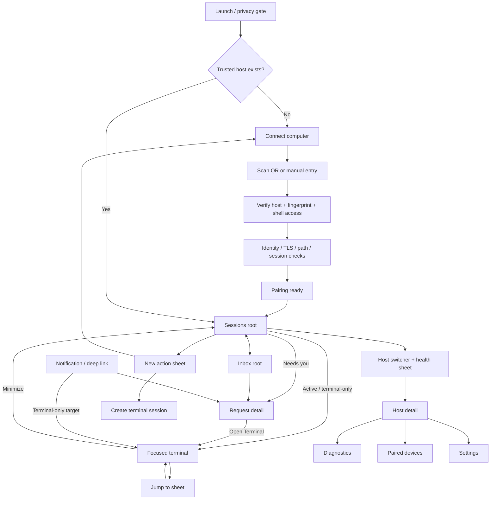

# Mocha V1 screen and navigation map

**Status:** Locked product-navigation contract for V1 planning
**Updated:** 2026-08-19
**Visual references:** [`assets/agent-deck-v1-pairing-flow.png`](./assets/agent-deck-v1-pairing-flow.png) and [`assets/agent-deck-v1-home-terminal.png`](./assets/agent-deck-v1-home-terminal.png)

This document defines which surfaces exist in V1, how users enter and leave them, what state each surface owns, and which experiences are deliberately deferred. It is a product and navigation contract, not a SwiftUI implementation prescription.

## 1. Navigation model in one sentence

Mocha has two persistent roots—**Sessions** and **Inbox**—plus a separate **New** action; pairing replaces the app shell until at least one host is trusted, while the terminal becomes a focused full-screen surface that can be minimized without ending work.

## 2. Locked navigation principles

1. **Two destinations, not a dashboard taxonomy.** The bottom dock contains `Sessions` and `Inbox`; the separate `+` button opens actions and is not a third tab.
2. **Terminal is focused and full-screen.** Opening a terminal hides the root dock. Minimizing returns to the originating screen and never kills tmux, Herdr, or the CLI.
3. **Management is contextual.** Hosts, diagnostics, paired devices, and settings live behind the connection-health control rather than permanent root tabs.
4. **Hierarchy appears where it is useful.** The Home does not flatten host → server session → workspace → tab → pane. `Jump to` exposes that hierarchy inside the terminal.
5. **Structured context never traps the user.** Every trustworthy request detail offers `Open Terminal`; unsupported or ambiguous sessions open the terminal directly.
6. **One exact target identity.** Routes use `{host, provider, serverSession, workspace/window, tab, pane}`. Reopening a target reuses it rather than creating a duplicate.
7. **Back means leave the view, not stop the work.** Destructive session operations always require a separate explicit action and confirmation.
8. **Sheets are transient.** Pairing choices, host switching, new actions, and `Jump to` use sheets; core work uses push navigation or the focused terminal.

## 3. Top-level map



## 4. Presentation hierarchy

| Level | Surface | Presentation | Dock | Owns durable work? |
| --- | --- | --- | --- | --- |
| Root gate | Launch/privacy gate or pairing | Root replacement | Hidden | No |
| App roots | Sessions, Inbox | Two-tab app shell | Visible | No |
| Focused detail | Request detail, Host detail, Settings | Navigation destination | Hidden in V1 | No |
| Terminal | Exact live terminal target | Root-level full-screen presentation | Hidden | No; host multiplexer owns it |
| Transient choice | New, host switcher, Jump to, manual pairing, confirmations | Native sheet or confirmation dialog | Underlying root retained | No |
| Recovery | Offline, stale, reconnecting, revoked, ambiguous input | Inline banner/state or blocking sheet only when required | Context-dependent | No |

## 5. Complete V1 screen inventory

### 5.1 Launch and pairing

| ID | Surface | Purpose | Primary entry | Primary exit |
| --- | --- | --- | --- | --- |
| `R0` | Launch / privacy gate | Restore encrypted local state, optionally require Face ID, choose pairing or main shell. | App launch, foreground after lock. | `P0` when unpaired; `S0` when paired; exact deep link after validation. |
| `P0` | Connect computer | State the local-execution boundary and start QR pairing immediately. | First run; `Pair another computer`. | `P1`; manual fallback `P1M`. |
| `P1` | QR scanner | Read a short-lived pairing payload. | `Scan pairing code`. | `P2`; camera denial keeps `P1M` visible. |
| `P1M` | Manual pairing | Enter private HTTPS endpoint and one-time code. | Scanner fallback. | `P2`; back to `P0`. |
| `P2` | Verify computer | Match machine name and fingerprint; disclose shell-level access at consent. | Valid QR/manual payload. | `P3` after `Pair securely`; cancel invalidates local pending state. |
| `P3` | Pairing checks | Progressively verify identity, TLS, path, latency, credential issuance, and session discovery. | Confirm pairing. | `P4`; actionable failure state remains here. |
| `P4` | Computer ready | Summarize trust, path, discovered sessions, Keychain storage, revocation, and safe disconnect. | Successful checks. | `S0` through `View sessions`. |

### 5.2 Root surfaces

| ID | Surface | Purpose | Primary entry | Primary exit |
| --- | --- | --- | --- | --- |
| `S0` | Sessions Home | Show `Needs you`, active sessions, and recent work across trusted hosts. | Main launch; terminal minimize; pairing complete. | `Q0`, `T0`, `H0`, `N0`, or `I0`. |
| `I0` | Inbox | Show unresolved attention events first and resolved history second. | Inbox dock item; `Needs you` summary; notification after root validation. | `Q0`; switch to `S0`. |
| `N0` | New action sheet | Offer only context-valid creation actions. | Separate `+` action. | `P0` for another computer; `N1` for a new terminal session. |

`N0` contains:

- `Pair another computer`.
- `Start a terminal session` when at least one eligible host is online.
- No provider-account sign-in and no model catalog.

### 5.3 Attention and session surfaces

| ID | Surface | Purpose | Primary entry | Primary exit |
| --- | --- | --- | --- | --- |
| `Q0` | Request detail | Explain what needs attention, why the state is trusted, and what exact target will receive input. | Needs-you row, Inbox event, deep link. | Structured action, `Open Terminal`, or back to origin. |
| `Q1` | Risk confirmation | Confirm destructive or externally initiated commands with exact host/session target. | High-impact action from `Q0`, `N1`, `H1`, or `H3`. | Commit or cancel to origin. |
| `N1` | New terminal session | Choose host, provider, working directory, optional session name, and command. | `N0`. | Create and open `T0`; cancel to `S0`. |
| `T0` | Focused terminal | Render and control the exact PTY through GhosttyKit; terminal remains source of truth. | Active session row, request detail, notification, new session. | Minimize to origin; `T1`; terminal-context sheet. |
| `T1` | Jump to | Navigate provider hierarchy without leaving terminal context. | `Jump` when more than one valid target exists. | Focus selected target and dismiss back to `T0`. |

`Q0` shows structured actions only when the provider advertises them and the event is fresh. Otherwise it labels the state `Unknown` or `Terminal only` and leads with `Open Terminal`.

`T1` adapts without changing the surrounding terminal:

- **Herdr:** workspace → tab, with Current and trustworthy attention state.
- **tmux:** session → window → pane.
- **Generic terminal:** hide `Jump` when there is no meaningful alternate target.

## 6. Host management and settings

| ID | Surface | Purpose | Primary entry | Primary exit |
| --- | --- | --- | --- | --- |
| `H0` | Host switcher + health | Show every host, online state, direct/relay/unknown path, latency, and last seen. | Connection-health control on `S0` or `I0`. | Choose/filter host, `H1`, Settings, or dismiss. |
| `H1` | Host detail | Manage address, reconnect, sessions, diagnostics, devices, and removal. | Host row in `H0`. | `H2`, `H3`, edit, remove confirmation, or back. |
| `H2` | Diagnostics | Explain path, latency, TLS, protocol version, capabilities, and recent failures without exposing terminal content. | `H1`; recovery affordance. | Back to `H1`. |
| `H3` | Paired devices | Name, last seen, and revoke individual phone credentials. | `H1`. | Device revoke confirmation or back. |
| `G0` | Settings | Entry to security, terminal controls, privacy, demo, and support. | Gear in `H0`; app-level menu where platform conventions require it. | `G1`, `G2`, `G3`, or dismiss/back. |
| `G1` | Security and privacy | Face ID/app lock, clipboard/privacy defaults, diagnostic-sharing consent. | `G0`. | Back. |
| `G2` | Terminal and controls | Font size, theme, scrollback bound, quick-key layout, keyboard behavior. | `G0`. | Back. |
| `G3` | Demo, support, and about | Offline reviewer/demo host, diagnostics export, licenses, version, support. | `G0`. | Demo `S0` or back. |

Settings are not a bottom tab in V1. Host management is one tap from the persistent health control; global preferences remain one additional tap away.

## 7. Home behavior contract

### Needs you

- The summary opens `I0` filtered to unresolved events.
- A specific session/event opens `Q0`.
- State must include provenance and freshness; generic terminal output never creates authoritative approval UI.

### Active sessions

- Tapping an active terminal-only session opens `T0` immediately.
- Tapping a session with a fresh blocking request opens `Q0` first.
- Reopening an already active target reuses its terminal controller and restores the intended multiplexer focus.

### Recent sessions

- Structured completion/review context opens `Q0` in resolved/read-only mode.
- Otherwise the row resumes `T0` or clearly reports that the target no longer exists.

## 8. Terminal navigation and lifecycle contract

- The full-screen terminal hides the bottom dock but preserves the underlying tab and navigation path.
- The top header always shows project/session identity plus host/provider context.
- Minimize/dismiss detaches the phone presentation only; it never sends process termination.
- When returning to a parked Herdr target, Mocha refocuses the expected workspace/tab before enabling input.
- The app may retain several active session controllers, but only one terminal surface is foregrounded. Memory and scrollback remain bounded.
- If the input delivery result is ambiguous, sending is disabled until the exact target is resynchronized; uncertain bytes are never replayed automatically.
- `Jump` is an accelerator, not the only navigation route. Status, labels, and rows remain accessible to VoiceOver and do not depend on color alone.

## 9. Deep-link resolution

1. Receive an internal notification/deep-link target without terminal content in the payload.
2. Pass through `R0`; authenticate if required.
3. Confirm that the host credential is valid and load the latest session/event metadata.
4. If the event has trustworthy structured context, open `Q0`.
5. Otherwise open the exact `T0` target.
6. If a matching terminal controller already exists, reuse it and restore its intended focus.
7. If the host is unavailable, show cached context as stale and withhold ambiguous actions.

No deep link creates a duplicate host, provider session, agent, or terminal target.

## 10. Recovery states

These are states of existing screens, not additional navigation destinations unless security requires blocking access.

| State | Surface behavior | Allowed action |
| --- | --- | --- |
| No hosts | `S0` becomes a focused connect state. | Open `P0` or demo mode. |
| Camera denied | `P1` explains the permission and keeps manual pairing visible. | Open Settings or `P1M`. |
| QR expired/used | `P2/P3` fails closed without retaining the secret. | Scan a new code. |
| Host offline/asleep | Cached sessions remain visibly stale. | Retry, open `H2`, or switch host. |
| Relay/slow path | Keep the current task visible; show path and latency unobtrusively. | Continue, retry direct, or open `H2`. |
| Credential revoked | Clear in-memory secret material and block all session actions. | Remove local host or pair again. |
| No sessions | Host remains valid; do not imply failure. | `N1`, pair another host, or demo. |
| Unknown agent state | Show `Unknown`/`Terminal only` with provenance. | Open `T0`. |
| Reconnecting terminal | Preserve view and draft; show inline status. | Wait, cancel draft, or inspect connection. |
| Ambiguous input | Freeze send and never auto-replay. | Resynchronize, then let user decide. |

## 11. Suggested SwiftUI coordination boundary

The implementation may change names, but it should preserve these responsibilities:

```text
AppCoordinator
  appGate: locked | pairing | main
  selectedRoot: sessions | inbox
  sessionsPath
  inboxPath
  presentedSheet
  activeTerminalTarget

PairingCoordinator
  pendingPayload
  verifiedHostIdentity
  progressiveChecks

TerminalCoordinator
  controllers keyed by exact target identity
  foregroundTarget
  inputDeliveryState
  providerFocusState
```

The terminal is presented from the app coordinator rather than owned by one tab, allowing Home, Inbox, and deep links to activate the same exact target without duplicating the terminal.

## 12. V1 exclusions

- Provider-account login or OAuth inside Mocha.
- A permanent Hosts or Settings bottom tab.
- Files, source control, preview browser, usage analytics, and worktree management as root destinations.
- A provider-specific Claude or Codex navigation hierarchy.
- Structured Chat as a requirement for V1; it remains a capability-gated sibling view planned after the terminal baseline.
- Push-notification configuration in first-run pairing; notification capability belongs to a later setup moment when available.
- Hidden-gesture-only navigation.

## 13. Acceptance checks before SwiftUI implementation expands

- A user can pair from launch to Sessions Home without choosing a model provider.
- A user can identify and open the correct waiting session in under five seconds.
- A terminal-only session reaches the exact PTY with one tap from Home.
- Request detail always identifies host, session, freshness, and state provenance.
- Terminal minimize, app background, and navigation back never terminate host work.
- Jump selects the correct Herdr or tmux target and restores expected focus before input.
- Offline, revoked, expired, and ambiguous-input states fail safely without dead ends.
- VoiceOver, Dynamic Type, Reduce Motion, Increase Contrast, camera-denial fallback, and hardware keyboard paths are covered in the navigation prototype.

